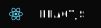

### Hi there 👋 my name is Andrey Gripich.
I'm a Front-end developer from Minsk, Belarus.

Languages and Technologies:

Follow me in Telegram👉 [https://t.me/Dittmerok](https://t.me/Dittmerok)

Contact me via [Linkedin](https://www.linkedin.com/in/andrey-hrypich-571b4b193/), 
email gripicha@yandex.by
or by phone: +375295728693.

<!--
**DittmerOk/DittmerOk** is a ✨ _special_ ✨ repository because its `README.md` (this file) appears on your GitHub profile.

Here are some ideas to get you started:

- 🔭 I’m currently working on ...
- 🌱 I’m currently learning ...
- 👯 I’m looking to collaborate on ...
- 🤔 I’m looking for help with ...
- 💬 Ask me about ...
- 📫 How to reach me: ...
- 😄 Pronouns: ...
- ⚡ Fun fact: ...
-->
